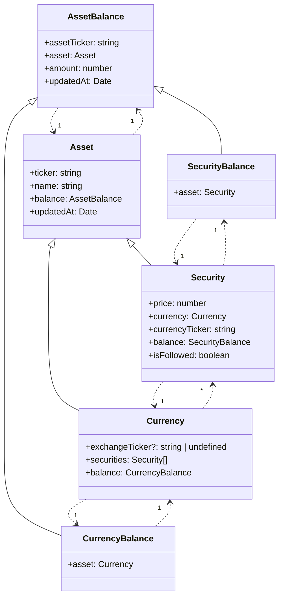

# Domain model

Tradeb0t operates with specific domain model in order to provide a unified way to work with different exchanges and assets.

::alert{type="info"}
Tradeb0t stores information only about one account, because it is designed to be used by one person.
::

## Assets

Information about assets is stored in the memory, because this information required only if it is fresh. Also, application does not use disk resources to write and read this information.


## Algorithms

Information about algorithms is persistanly stored in the SQLite file, because it should be available between sessions.

```mermaid
classDiagram
class Order {
    +exchangeId: string
    +securityTicker: string
    +status: OrderStatus
    +operation: "undefined" | "limit_buy" | "limit_sell" | "market_buy" | "market_sell" | "buy_or_cancel" | 
"sell_or_cancel"
    +lots: number
    +price: number
    +updatedAt?: Date | undefined
    +algorithmRunId?: number | undefined
    +algorithmRun?: AlgorithmRun<any, any> | undefined
}
class AlgorithmRun~InputType, StateType~ {
    +id: number
    +algorithmName: string
    +inputs: InputType
    +status: AlgorithmRunStatus
    +state: StateType
    +updatedAt: Date
    +createdAt: Date
    +algorithm: Algorithm
    +orders: Order[]
}
class Algorithm {
    +name: string
    +description: string
    +inputTypes: InputTypes
    +algorithmRuns?: AlgorithmRun<any, any>[] | undefined
}
Order ..> "1" AlgorithmRun
AlgorithmRun ..> "1" Algorithm
AlgorithmRun ..> "*" Order
Algorithm ..> "1" AlgorithmRun
```