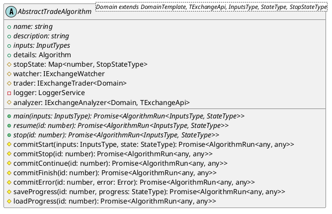

# Overview

Tradeb0t provides abstract classes for trading algorithms. It is designed to make it possible to reuse the same code for different exchanges. 

## Main functionality

You just need to implement 3 main methods:

- `main` - main method of the algorithm. It is called every time when the algorithm is executed.
- `resume` - method that is called when the algorithm is resumed after the pause.
- `stop` - method that is called in order to stop the algorithm.

## Storage utils

`AbstractAlgorithm` class also provides the following methods for saving specific state of the algorithm to storage:

- `commitStart` - saves the state of the algorithm before the `main` method is called.
- `commitContinue` - saves the state of the algorithm after it is resumed.
- `commitFinish` - saves the state of the algorithm after it is successfully finished.
- `commitError` - saves the state of the algorithm after error occured.

## Class diagram

